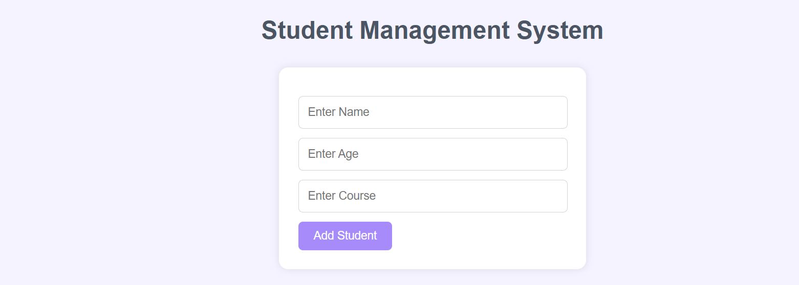

# Student Management System

A simple CRUD web application built using Flask and MySQL.

## Features
- Add Student Records
- View Student Details
- Update Student Information
- Delete Student Records
- MySQL Database Integration
- Responsive User Interface

## Screenshots
### Home Page

## Technologies Used
- Python
- Flask
- MySQL
- HTML
- CSS
- Git & GitHub

## Project Structure

student-management-system/
│
├── app.py
├── README.md
│
├── templates/
│   ├── index.html
│   └── update.html
│
├── static/
│   └── style.css
│
├── screenshots/
│   ├── home_page.png
│   ├── homepage_css.png
│   └── homepage_css_2.png

## How to Run Project

1. Install Flask
2. Configure MySQL database
3. Run app.py

## Author
Akshaya